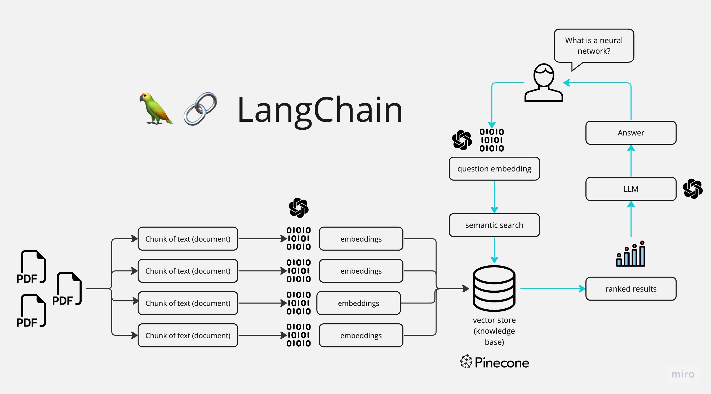

# Ask-Your-Second-Brain
Ask your second brain is a LLM based Q&amp;A application, built with the help of the Langchain framework.


# How it works 
---



The application follows these steps to provide responses to your questions:

1. PDF Loading: The app reads multiple PDF documents and extracts their text content.

2. Text Chunking: The extracted text is divided into smaller chunks that can be processed effectively.

3. Language Model: The application utilizes a language model to generate vector representations (embeddings) of the text chunks.

4. Similarity Matching: When you ask a question, the app compares it with the text chunks and identifies the most semantically similar ones.

5. Response Generation: The selected chunks are passed to the language model, which generates a response based on the relevant content of the PDFs.


# Project Setup

# 🚀 LangChain Project Setup using `uv`

This documentation demonstrates how to set up the project using **`uv`** for fast virtual environment and dependency management.

The setup follows **LangChain ≥1.x best practices** and is suitable for:
- LLM applications
- RAG systems
- Agents (LangGraph)
- FastAPI / Streamlit deployments

## ✅ Prerequisites

Ensure you have the following installed:

- Python **3.10+**
- `pip`
- Git (recommended)

Check Python version:
```bash
python --version
```

---

## 1️⃣ Install `uv`

### Windows / macOS / Linux
```bash
pip install uv
```

Verify installation:
```bash
uv --version
```

**Why `uv`?**
- ⚡ Extremely fast (Rust-based)
- 📦 Manages virtual environments and dependencies together
- 🧼 Replaces `pip`, `venv`, and `requirements.txt`

---


## 1️⃣ Clone the Repository

```bash
git clone https://github.com/work-mohit/Ask-Your-Second-Brain.git
cd Ask-Your-Second-Brain
```

---

## 2️⃣ Install `uv` (One-time Setup)

If `uv` is not installed:

```bash
pip install uv
```

Verify:
```bash
uv --version
```

Why `uv`?
- Very fast (Rust-based)
- Handles **virtualenv + dependencies**
- Replaces `pip + venv + requirements.txt`

---

## 3️⃣ Create & Activate Virtual Environment

Create the virtual environment:
```bash
uv venv
```

Activate it:

### Windows
```powershell
.venv\Scripts\activate
```

### macOS / Linux
```bash
source .venv/bin/activate
```

You should now see `(.venv)` in your terminal.

---

## 4️⃣ Install Project Dependencies

Install all dependencies defined in `pyproject.toml`:

```bash
uv sync
```

📌 If this is the **first setup**, this will:
- Resolve versions
- Install dependencies
- Use `uv.lock` if present

---

## 5️⃣ Environment Variables Setup

Create a `.env` file in the project root:

```env
HUGGINGFACEHUB_API_TOKEN=your_hf_token_here
OPENAI_API_KEY=your_openai_key_here
```

⚠️ **Important**
- Do NOT commit `.env` to Git
- Add `.env` to `.gitignore` (I have already added, you can cross check in `.gitignore` file.)

---

## 6️⃣ Project Structure (Reference)

```text
Ask-Your-Second-Brain/
│
├── app/
│   ├── __init__.py
│   ├── main.py
├── .env
├── .venv/
├── pyproject.toml
├── uv.lock
|── README.md
└── SETUP.md
```
---

## 7️⃣ Run the Application


Run below commad to run the  **Streamlit** Application:
```bash
streamlit run app/main.py
```
